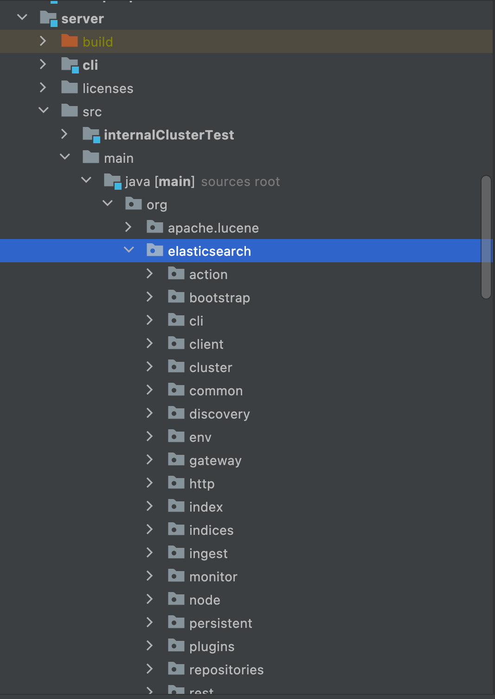

#Elasticsearch 源码编译
> 基于Elasticsearch 7.13

## clone 源码
```java
git clone https://github.com/elastic/elasticsearch.git
git checkout --track origin/7.13
```


## 依赖版本
1. JDK
   jdk 14
2. Gradle
   * gradle7.x
   * 本地gradle 配置下仓库
   ```java
    vim ~/.gradle/init.gradle
    allprojects {
        repositories {
            maven { url 'https://maven.aliyun.com/repository/public/' }
            maven { url 'https://maven.aliyun.com/repository/spring/'}
            maven { url 'https://maven.aliyun.com/repository/gradle-plugin' }
            maven { url 'https://maven.aliyun.com/repository/google' }
            mavenLocal()
            mavenCentral()
        }
    }
    ```
注意: idea gradle 配置jvm 需要设置jdk14，项目java版本设置11即可


## 编译
1. 执行 gradle idea
2. 导入idea

## 启动Elasticsearch实例
1. jvm.options文件添加配置
   -agentlib:jdwp=transport=dt_socket,server=y,suspend=n,address=5005
2. 执行下面命令
```java
# 打开terminal进入源码目录下执行以下命令
./gradlew run
# 由于我们认证并没有关闭，因此启动ES实例的访问需要认证信息
用户：elastic-admin 密码：elastic-password
```

## 源码
核心源码在server这个模块下

* cluster模块，集群管理相关功能
* discovery模块，实现的master选举及其他节点的加入与脱离通知
* transport模块，实现了节点间通信逻辑
* rest模块，其中注册了各种http请求接口

